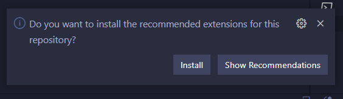
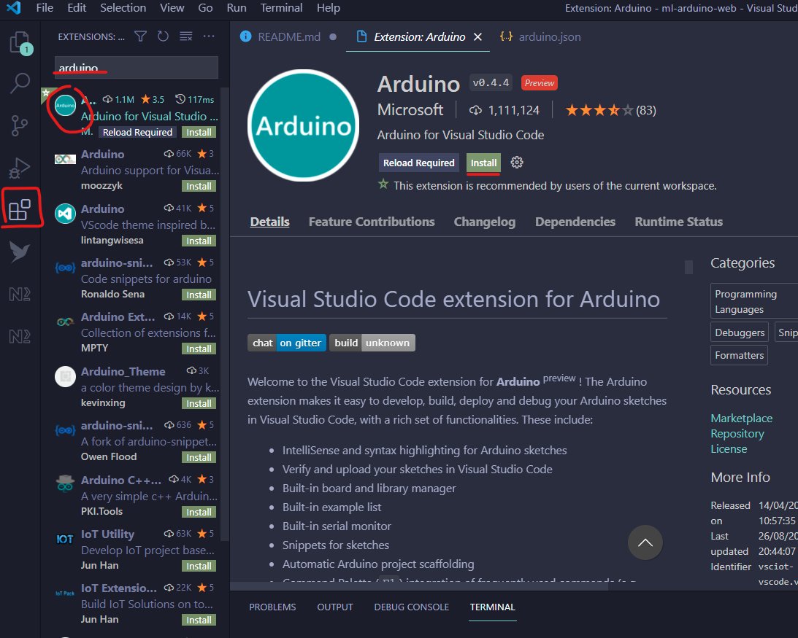
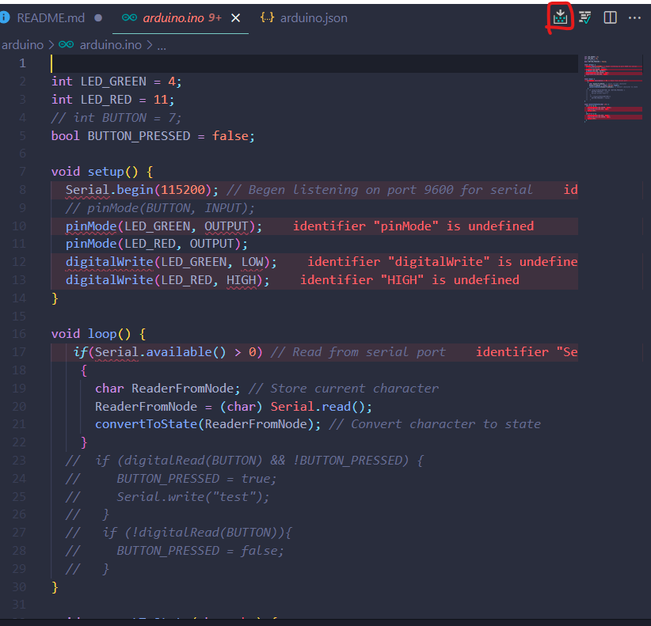

## Breadboard

## Run Code

1. Install arduino extension

   1. 
   2. Or 

2. Upload code to arduino
   1. Connect arduino to PC
   2. In vscode click `F1` write `Arduino: Select Serial Port`
      1. Remember the port you selected
   3. Open `arduino/arduino.ino` Upload code
      1. 
